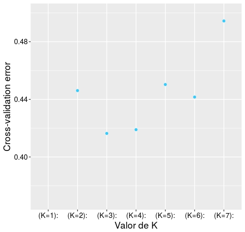
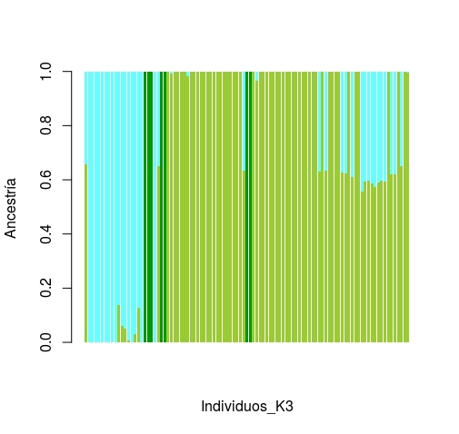
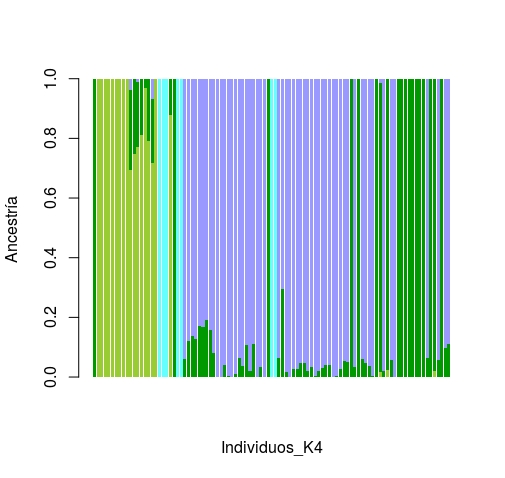
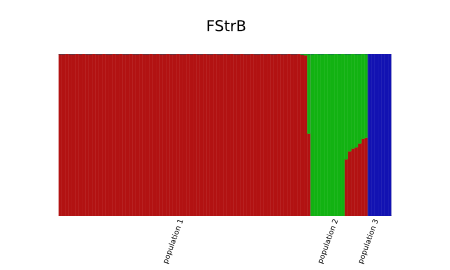
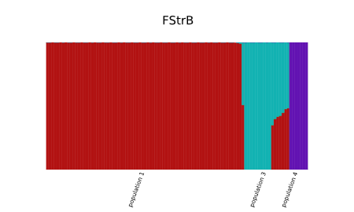

# Avances 2: Diario de actividades

**Nota:** En este escrito no se incluyen rutas a  los archivos ni los *scripts* de **R** con los que se generaron las gráficas de *admixture*. 

## *sofwares* utilizados hasta el momento:
### Para análisis
 - Tassel 
 - Admixture
 - Faststructure
 - Structure
 - R 
 
### Para transformación de datos:
 - vcftools
 - Plink 
 - PGDspider 
  
## *Papers* leidos
- Bryc, K., Auton, A., Nelson, M. R., Oksenberg, J. R., Hauser, S. L., Williams, S., … Bustamante, C. D. (2010). Genome-wide patterns of population structure and admixture in West Africans and African Americans, 107(2). https://doi.org/10.1073/pnas.0909559107

- Francis, R. M. (2017). an R package and web app to analyse and visualize population structure POPHELPER :, 27–32. https://doi.org/10.1111/1755-0998.12509

## Resultados preliminares
Utilizando como base el archivo `B._rec.MCR50.vcf` transformado a los archivos de la familia **.plink**.

###Admixture 
Se corrio un for loop en `admixture` para realizar el análisis con diferentes **K**. 

```:::bash
for K in 1 2 3 4 5 6 7;
do ./admixture --cv=7 PBinaBeauMCR50.bed $K | tee log${K}.out; done
grep -h CV log*.out > /BeaucMCR50.txt
```
* Del análisis anterior, se obtuvieron:

**1.** El **análisis del error de validación cruzada** para cada una de las **k** probadas.
 
* Las siguientes gráficas se realizaron en **Rstudio**, con los datos obtenidos de `admixture`.  




**2.** El análisis de **admixture** para las 2 K (k=3 y k=4) más aceptadas. 




### FastStructure
También se corrio el análisis de `FastStructure`. Al igual que en `admixture` se realizo un **for loop**  para hacer el análisis con diferentes **K**. 

```:::bash
for K in 2 3 4 5;
do python structure.py -K $K --input=PBBeau --output=FStrB --full --seed=100; 
done
```
De los datos generados se corrio el siguiente ***script*** para seleccionar la **k** mas adecuada. 

```:::bash
 python chooseK.py --input=FStrB 
```

Donde se obtuvo:

```
Model complexity that maximizes marginal likelihood = 5
Model components used to explain structure in data = 3
```

Al correr el comando `distruct` se obtuvieron las siguientes gráficas preliminares:

```
python distruct.py -K 3 --input=FStrB -- output=distructk3.svg
```


```
python distruct.py -K 4 --input=FStrB --output=distructk4.svg
```
 

### Tareas por hacer
* Generar el árbol filogenético. 
* Arreglar las gráficas de admixture en **R**.
* Realizar las gráficas de FastStructure en **R**.
* Realizar el **README** del proyecto.
* Leer algunos manuales más. 
